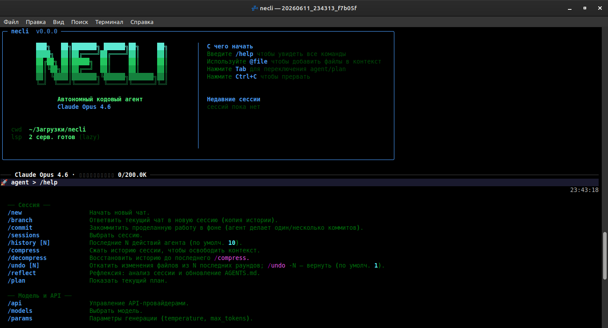
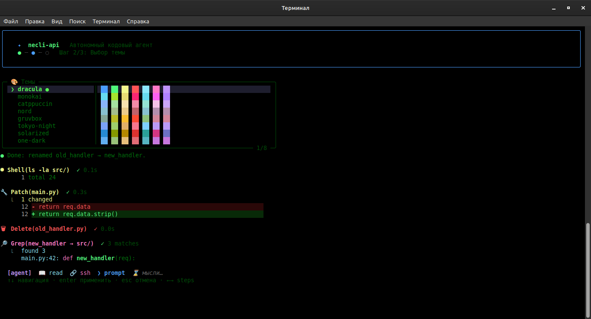
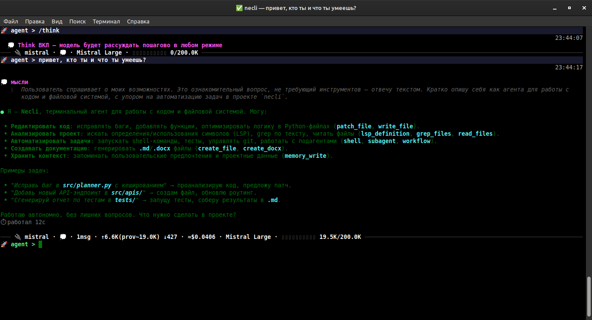
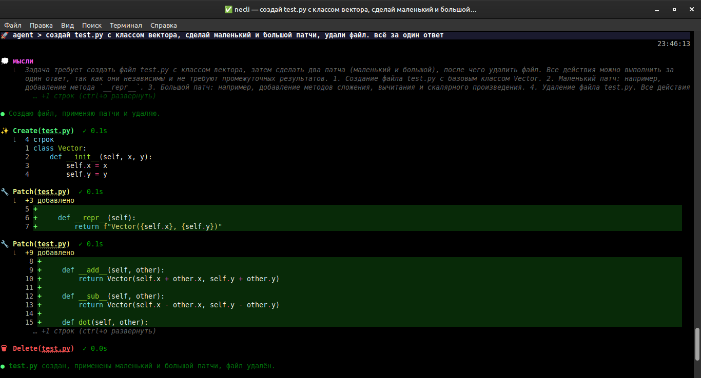

<div align="center">

# necli

**Автономный кодовый агент в твоём терминале.**

Один движок — и CLI с живым стримингом, и бот в Telegram. Подключается к любому LLM-провайдеру напрямую, пишет и правит код, гоняет команды, ищет в интернете, запускает параллельных субагентов и помнит контекст между сессиями.






</div>

---

## Что это

**necli** — терминальный AI-агент: ты пишешь задачу обычным языком, а он сам читает файлы, пишет и правит код, запускает shell-команды, ищет в сети и доводит дело до результата — со стримингом ответа и инструментов прямо в терминале. Работает с любым OpenAI-совместимым провайдером (свои или облачные модели), без браузера и без посредников.

- 🧠 **Любой LLM** — Anthropic, OpenAI, Google, Groq, OpenRouter, xAI, а также локальные Ollama / LM Studio (8 провайдеров из коробки + любой OpenAI-совместимый). Несколько ключей на провайдера с автоматической ротацией при rate-limit.
- ⚡ **Живой стриминг** — ответ и выполнение инструментов видно в реальном времени, прямо по ходу.
- 🛠 **Реально делает работу** — читает/пишет/правит файлы, запускает команды, ищет в интернете, работает по SSH, создаёт `.docx`.
- 🤖 **Параллельные субагенты** — крупную задачу можно разложить на десятки независимых агентов с фазами, зависимостями и проверкой.
- 💾 **Помнит контекст** — долговременная память проекта, сессии, undo/redo изменений файлов.
- 📱 **Telegram-мост** — общайся с агентом со смартфона, тем же ядром.
- 🤫 **Headless-режим** — встраивается в CI, pre-commit, cron, пайпы.

---

## Установка

Нужен Python ≥ 3.10 и [`uv`](https://github.com/astral-sh/uv).

```bash
pip install uv
git clone https://github.com/neuralguy/necli.git
cd necli
uv sync
```

Запуск:

```bash
uv run python src/main.py cli
```

При первом запуске откроется онбординг — выбери провайдера, вставь API-ключ и можно работать. Ключи хранятся локально (`.data/config.json`) и никуда не уходят, кроме как в выбранного тобой провайдера.

---

## Как пользоваться

Запусти, напиши задачу обычным языком — и наблюдай, как агент её выполняет:

```
> добавь кеширование в api-клиент и покрой тестами
```

```
> почему падает тест test_login? найди и почини
```

```
> @src/app.py отрефактори этот файл под async
```

- **`@file`** — подставить файл(ы) в контекст.
- **`Tab`** — переключить режим agent ⇄ planning (планирование без правок).
- **`Ctrl+C`** — прервать, **`Ctrl+P`** — вставить изображение из буфера.

### Полезные команды

| Команда | Что делает |
|---|---|
| `/new` · `/sessions` · `/history` | Новая сессия / список / восстановление прошлых |
| `/compress` · `/decompress` | Сжать / развернуть контекст сессии |
| `/api` · `/models` · `/params` | Провайдер (с ротацией ключей), модель (с поиском), параметры генерации |
| `/proxy` | Прокси для запросов к провайдерам |
| `/undo N` · `/undo -N` | Откатить / вернуть изменения файлов за раунд N |
| `/commit` · `/branch` | Сгенерировать коммит / создать ветку |
| `/agents` · `/insights` | Заготовки субагентов · аналитика всех сессий в HTML-отчёт |
| `/skills` · `/mcp` · `/lsp` · `/ssh` | Скиллы, MCP-серверы, LSP, удалённые хосты |
| `/permissions` | Разрешения инструментов: разово, на сессию или навсегда |
| `/themes` · `/lang` · `/think` | Тема оформления, язык интерфейса, режим размышлений |
| `/stats` · `/copy` · `/tg` | Статистика токенов, копирование ответа, Telegram-мост |
| `/help` | Полный список команд |

Интерфейс на **5 языках** (en, ru, de, fr, zh) и с готовыми темами (Dracula, Monokai, Catppuccin, Nord, Gruvbox, Solarized).

---

## Возможности

**Агент, который доводит до конца.** Не просто отвечает текстом — сам читает код, вносит правки, запускает тесты и команды, проверяет результат и идёт до рабочего решения. Любой шаг с файлами можно отменить через `/undo`.

**Параллельные субагенты.** Большую задачу можно разбить на независимые куски и запустить десятки субагентов одновременно — с ролями, зависимостями, фазами (`phases` / `items+stages` в одном вызове) и опциональной git-worktree-изоляцией (каждый в своей ветке, без конфликтов). Живая панель прогресса показывает, какие агенты что делают сейчас, токены и стоимость прогона, и помечает завершённые фазы зелёным.

**Память между сессиями.** Агент сам запоминает важные факты о проекте и твоих предпочтениях и подмешивает их в следующие сессии — не нужно объяснять контекст заново.

**Расширения.** Скиллы (специализированные инструкции по запросу), серверы **MCP** (внешние инструменты), **LSP** (переходы/ссылки/диагностика по коду), пул **SSH** для работы с серверами, генерация **`.docx`** (включая формулы и таблицы), веб-поиск.

**Telegram-мост.** Подключи бота — и тот же агент доступен со смартфона: пишешь задачу в чат, получаешь стриминг ответа.

**Headless для автоматизации.** Один проход агента из консоли — для CI, cron, pre-commit или пайпов:

```bash
echo "посчитай строки .py в проекте" | uv run python src/main.py run --quiet --allow-all
git diff --staged | uv run python src/main.py run "напиши сообщение коммита" --json | jq -r .text
```

**Безопасность.** Опасные инструменты спрашивают разрешение (с превью того, что именно будет сделано) — разово, на сессию или навсегда. В headless без TTY такие действия по умолчанию запрещаются.

---

## Конфигурация

Всё состояние — рядом с проектом в `.data/` (ключи, сессии, скиллы, память, undo). Каталог чистится автоматически от старого мусора. Путь можно переопределить переменной `NECLI_HOME`.

---

## Документация для разработчиков

Архитектура, агентный цикл, формат tool-calls, устройство субагентов/памяти и структура кода — в **[`DOCS.md`](DOCS.md)**.

---

## Лицензия

Apache-2.0 — см. [`LICENSE`](LICENSE).
