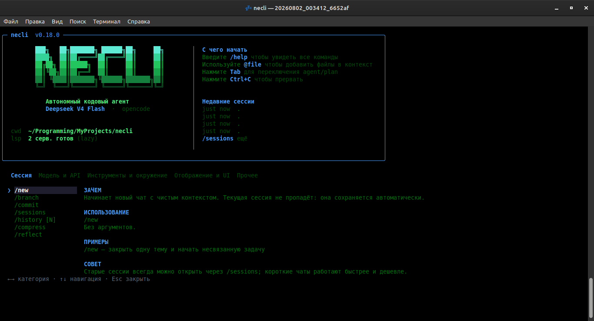
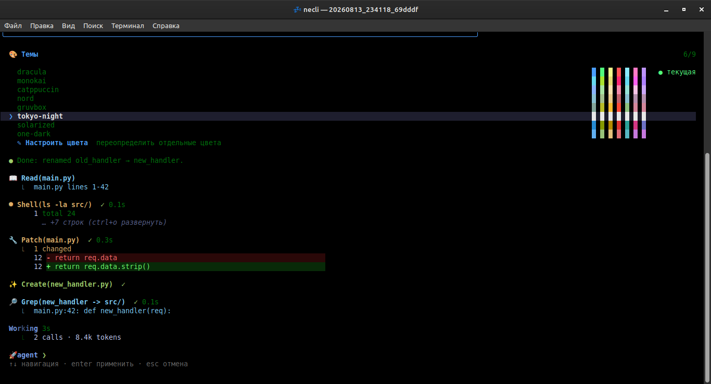
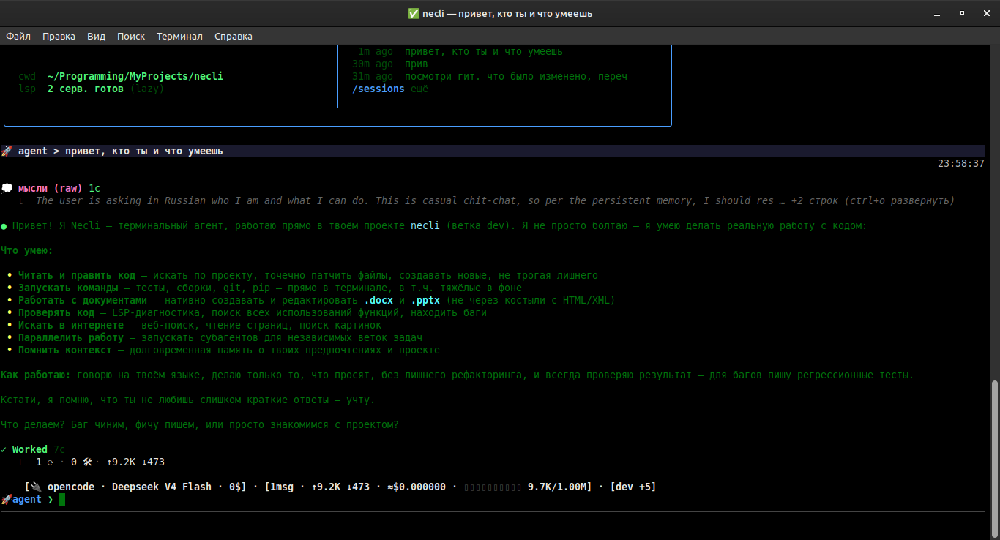
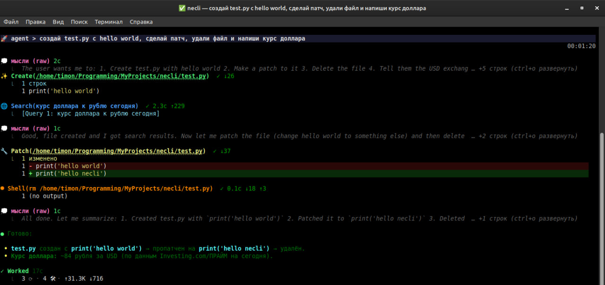

<div align="center">

# necli

**Автономный кодовый агент в твоём терминале.**

Один движок — и CLI с живым стримингом, и бот в Telegram. Подключается к любому LLM-провайдеру напрямую, пишет и правит код, гоняет команды, ищет в интернете, запускает параллельных субагентов и помнит контекст между сессиями.






</div>

---

## Что это

**necli** — терминальный AI-агент: ты пишешь задачу обычным языком, а он сам читает файлы, пишет и правит код, запускает shell-команды, ищет в сети и доводит дело до результата — со стримингом ответа и инструментов прямо в терминале. Работает с любым OpenAI-совместимым провайдером (свои или облачные модели), без браузера и без посредников.

- 🧠 **Любой LLM** — Anthropic, OpenAI, Google, Groq, OpenRouter, xAI, а также локальные Ollama / LM Studio (8 провайдеров из коробки + любой OpenAI-совместимый). Несколько ключей на провайдера с автоматической ротацией при rate-limit.
- ⚡ **Живой стриминг** — ответ и выполнение инструментов видно в реальном времени: tool-блоки выполняются инлайн прямо по ходу генерации.
- 🛠 **Реально делает работу** — читает, пишет и правит файлы, запускает команды, ищет в интернете, собирает `.docx` (включая формулы и таблицы).
- 🤖 **Параллельные субагенты** — крупную задачу можно разложить на десятки независимых агентов с фазами, зависимостями и изоляцией.
- 💾 **Помнит контекст** — долговременная память проекта и сессий.
- 📱 **Telegram-мост** — общайся с агентом со смартфона, тем же ядром.
- 🤫 **Headless-режим** — встраивается в CI, pre-commit, cron, пайпы.

---

## Установка

Нужен Python ≥ 3.10 и [`uv`](https://github.com/astral-sh/uv).

```bash
pip install uv
git clone https://github.com/neuralguy/necli.git
cd necli
uv sync
```

Запуск CLI:

```bash
uv run python src/main.py cli
```

Опции: `--api/-A` (провайдер), `--model/-m`, `--workdir/-w`, `--resume/-r` (возобновить сессию).

При первом запуске откроется онбординг — выбери провайдера, вставь API-ключ и можно работать. Ключи хранятся локально (`.data/apis.json`) и никуда не уходят, кроме как в выбранного тобой провайдера.

---

## Как пользоваться

Запусти, напиши задачу обычным языком — и наблюдай, как агент её выполняет:

```
> добавь кеширование в api-клиент и покрой тестами
```

```
> почему падает тест test_login? найди и почини
```

```
> @src/app.py отрефактори этот файл под async
```

- **`@file`** — подставить файл(ы) в контекст.
- **`Tab`** — переключить режим: **agent** (работает с кодом) ⇄ **planning** (только планирование, без правок) ⇄ **swarm** (оркестрация субагентов).
- **`Ctrl+C`** — прервать, **`Ctrl+P`** — вставить изображение из буфера обмена, **`Ctrl+O`** — переключить компактный/полный replay, **`Ctrl+V`** — вставить текст.

### Команды

| Команда | Что делает |
|---|---|
| `/new` | Новая сессия |
| `/sessions` | Список сессий |
| `/history [N]` | Показать историю текущей сессии |
| `/branch` · `/commit` | Создать ветку / сгенерировать коммит |
| `/compress` | Сжать контекст сессии |
| `/reflect` | Рефлексия сессии — предлагает правки для `AGENTS.md` |
| `/autoprune` | Авто-прунинг контекста по ходу сессии |
| `/api` · `/models` · `/params` | Провайдер (с ротацией ключей), модель (с поиском), параметры генерации |
| `/proxy [URL\|off]` | Прокси для запросов к провайдерам |
| `/cd PATH` | Сменить рабочую директорию |
| `/permissions` | Разрешения инструментов: разово, на сессию или навсегда |
| `/mcp` · `/lsp` · `/skills` | MCP-серверы, LSP, скиллы |
| `/agents` | Заготовки субагентов |
| `/themes` · `/lang` · `/think` | Тема оформления, язык интерфейса, режим размышлений |
| `/tool_format` | Формат tool-calls: fenced-блоки vs native function calling |
| `/insights` | Аналитика всех сессий в HTML-отчёт |
| `/stats [N]` | Статистика токенов и стоимости |
| `/copy [N]` | Скопировать последний ответ |
| `/tg` | Telegram-мост |
| `/help` | Полный список команд |

Интерфейс на **5 языках** (en, ru, de, fr, zh) и с 8 встроенными темами: Dracula (по умолчанию), Monokai, Catppuccin, Nord, Gruvbox, Tokyo Night, Solarized, One Dark.

---

## Возможности

**Агент, который доводит до конца.** Агентный цикл без ограничения по числу итераций: сам читает код, вносит правки, запускает тесты и команды, проверяет результат и идёт до рабочего решения. Всё это стримится в реальном времени.

**Инструменты.** Shell, файлы (read / grep / patch_file / create_file), веб (web_search / web_fetch / image_search), DOCX (create_docx + docx_screenshot с рендером в PNG), память (memory_write / memory_list / memory_read), LSP (lsp_references / lsp_diagnostics), субагенты и скиллы. Два формата tool-calls: fenced-блоки `:::call` и native function calling (переключатель `/tool_format`, по умолчанию native).

**Параллельные субагенты.** До 100 задач в одном вызове — с ролями/пресетами, зависимостями `depends_on` (DAG: топологическая сортировка и волны выполнения), фазами (`phases` / `items+stages` в одном вызове) и опциональной git-worktree-изоляцией (`isolate=true` — каждый агент работает в своей ветке, без конфликтов). Одновременно исполняются до 12 субагентов (`max_concurrency`), цикл каждого ограничен 200 итерациями. Живая панель прогресса показывает, какие агенты что делают сейчас, токены и стоимость прогона.

**Память между сессиями.** Проектная и глобальная долговременная память: агент сам запоминает важные факты о проекте и твоих предпочтениях, подмешивает их в следующие сессии и может обращаться к ним инструментами `memory_write` / `memory_list` / `memory_read` — не нужно объяснять контекст заново.

**Расширения.** Скиллы (специализированные инструкции в `.data/skills/`), серверы **MCP** (stdio, `.data/mcp_servers.json`), **LSP** (pyright, typescript-language-server, gopls, rust-analyzer по умолчанию), **хуки** — совместимые с claude-code, с событиями PreToolUse / PostToolUse / UserPromptSubmit / Stop / SessionStart / SessionEnd (`.data/hooks.json`).

**Telegram-мост.** Подключи бота — и тот же агент доступен со смартфона: пишешь задачу в чат, получаешь стриминг ответа, переключаешь режимы и модели из меню.

**Headless для автоматизации.** Один проход агента из консоли — для CI, cron, pre-commit или пайпов:

```bash
echo "посчитай строки .py в проекте" | uv run python src/main.py run --quiet --allow-all
git diff --staged | uv run python src/main.py run "напиши сообщение коммита" --json | jq -r .text
```

Доступны `--json`, `--quiet`, `--timeout`, `--allow-all`. В headless без TTY опасные инструменты по умолчанию отказывают (`NECLI_HEADLESS=1`).

**Безопасность.** Опасные инструменты спрашивают разрешение (с превью того, что именно будет сделано) — разово, на сессию или навсегда (ask / allow / deny, wildcard `*`). В headless без TTY такие действия по умолчанию запрещаются.

---

## Конфигурация

Всё состояние — в каталоге `.data/` рядом с проектом: провайдеры и ключи в `apis.json`, настройки в `config.json`, плюс сессии, скиллы, память и конфигурация хуков. Каталог чистится автоматически от старого мусора раз в сутки: сессии старше 30 дней (кроме последних 100 и закреплённых pinned), `subagents/` старше 14 дней, временные файлы старше 7 дней.

Путь можно переопределить переменной `NECLI_HOME` (в frozen-сборке по умолчанию `~/.necli`).

---

## Документация для разработчиков

Архитектура, агентный цикл, формат tool-calls, устройство субагентов/памяти и структура кода — в **[`DOCS.md`](DOCS.md)**.

---

## Лицензия

Apache-2.0 — см. [`LICENSE`](LICENSE).
